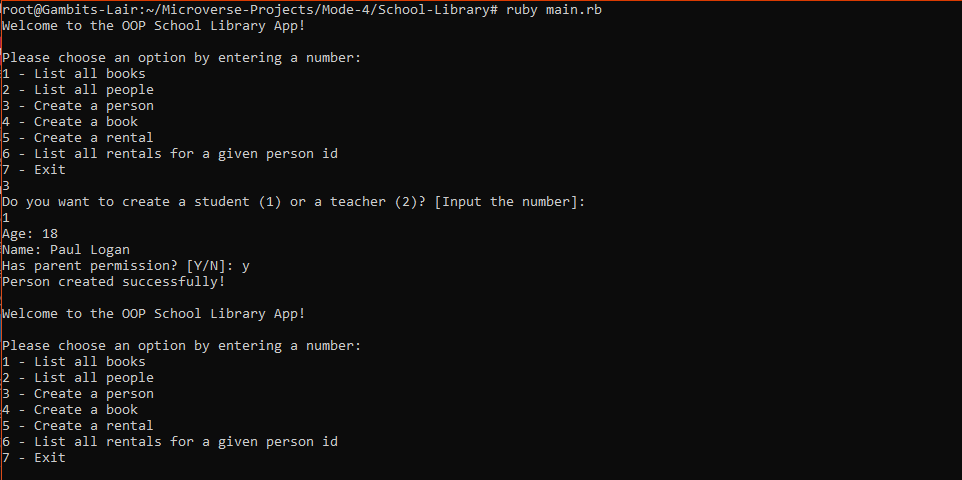
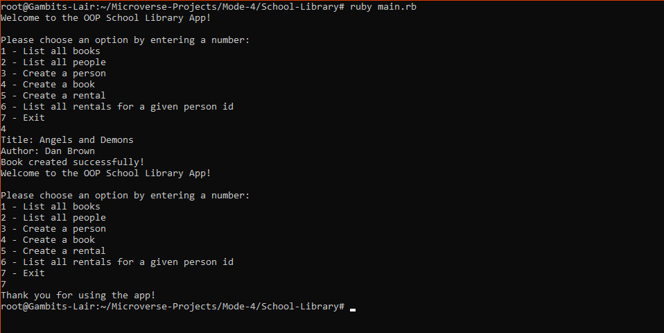

# School-Library
A tool that records what books are in a library and who borrows them

## Screenshots

> |Screenshot1|Screenshots2|
> |--------------|----------------|
> |||!

## Built With
- Ruby

## Getting Started

**The project comes shipped with linters config for ruby, so ensure you have Rubocop**
**installed on your local environment**

- **To get a local copy of the repository please run the following commands on your terminal:**
- **$ git clone https://github.com/Gambit142/School-Library.git
- **$ cd ...**
- **$ git checkout ...**
- **$ run `bundle install` to couple all dependecies**

## Author 1

👨🏿 **Francis Ugorji**

- GitHub: [@Gambit142](https://github.com/Gambit142)
- LinkedIn: [Francis Ugorji](https://www.linkedin.com/in/francis-ugorji/)

## Author 2

👨🏿 **Ajise Toluwase**
- GitHub: [@githubhandle](https://github.com/Whoistolu)
- LinkedIn: [LinkedIn](https://www.linkedin.com/in/toluwase-ajise-9b40411b2/)

## 🤝 Contributing

Contributions, issues, and feature requests are welcome!

Feel free to check the [issues page](../../issues/).

## Show your support

Give a ⭐️ if you like this project!

## Acknowledgments
- To [Microverse](https://www.microverse.org/)
## 📝 License
- This project is [MIT](./MIT.md) licensed.